## 红黑树

Tree Map与Hash Map中用到了红黑树，故一探究竟。

#### 1、红黑树的定义

红黑树是一种近似平衡的二叉查找树，它能够确保从根到叶子的最长的可能路径不多于最短的可能路径的两倍长。结果是这个树大致上是平衡的。因为操作比如插入、删除和查找某个值的最坏情况时间都要求与树的高度成比例，这个在高度上的理论上限允许红黑树在最坏情况下都是高效的，而不同于普通的二叉查找树。

它具有以下五个特性：

1. 节点是红色或者黑色的。
2. 根节点是黑色的。
3. 每个叶子节点是黑色的(叶子节点指NIL节点，空节点)。
4. 每个红色节点的两个子节点都是黑色的(从每个叶子到根的所有路径上不能有两个连续的红色节点)。
5. 从任一节点到其每个叶子的所有路径都包含相同数目的黑色节点。

在对红黑树进行插入或删除操作时往往会破坏上述条件，需要通过调整使得它重新满足红黑树的特性。

#### 2、红黑树结构调整的基本操作

##### 2.1、左旋

如动图，对节点E进行左旋操作，操作前节点S是节点E的右子节点，左旋操作后节点S取代节点E的位置，节点S由节点E的子节点上升为的父节点，节点E由节点S的父节点下降为左节点。左旋操作使得被操作节点的右子节点取代它的位置并上升为它的父节点，被操作节点下降为左子节点，原右节点的左子节点成为被操作节点的右子节点。


##### 2.2、右旋

如动图，对节点S进行右旋操作，操作前节点E是节点S的左子节点，右旋操作后节点E取代节点S的位置，节点E由节点S的子节点上升为父节点，节点S由节点E的父节点下降为右子节点。右旋操作使得被操作节点的左子节点取代它的位置并下降为它的右子节点，被操作节点上升为父节点，原左节点的右子节点成为被操作节点的左子节点。


#### 3、红黑树节点的插入或删除

##### 3.1、插入

###### 3.1.1、红黑树进行节点的插入时，首先将插入节点的值和各个节点的值进行比较，找到合适的位置，且新插入的值的颜色总为红色。

新插入节点总着色为红色的原因？

如果将新插入点着色为黑色，那么将不符合特性5，此时需要对树进行调整，调整后的树可能不符合特性4，则需要再次调整；如果将新插入点着色为红色，那么将符合特性5，但可能不符合特性4，此时需要对树进行调整。可见新插入点着色为黑色，至多需要两次调整，而着红色至多需要一次调整。

###### 3.1.2、父节点的颜色黑色，无需调整。

因为新插入的节点的位置将取代一个叶子节点，且此时其着色为红色，它的两个子节点为叶子节点，由特性3可知叶子节点是黑色的，此时父节点的为黑色，则满足所有特性，无需调整。

###### 3.1.3、父节点的颜色为红色，调整。

1. 当前节点的父节点是红色，且当前节点的父节点的另一个节点（叔叔节点）也是红色。
   
   此时的处理策略为：
   
   1. 父节点设置黑色；
   2. 叔叔节点设置黑色；
   3. 祖父节点设置红色；
   4. 设置祖父节点为当前节点。
   
2. 当前节点的父节点是红色，叔叔节点是黑色且当前节点是父节点的右孩子。

   此时的处理策略为：

   1. 将父节点作为新的当前节点；
   2. 以当前节点为支点左旋。

3. 当前节点的父节点是红色，叔叔节点是黑色且当前节点是父节点的左孩子。

   此时的处理策略为：
   
   1. 设置父节点为黑色；
   2. 设置祖父节点为红色；
   3. 以祖父节点为支点右旋。

每次操作后将祖父节点设置为当前操作节点，再对当前节点进行情况判断，是否符合以上三种情况，如果当前节点是根节点且为红色，则直接进行着色操作，着色为黑色即可。流程如下图：

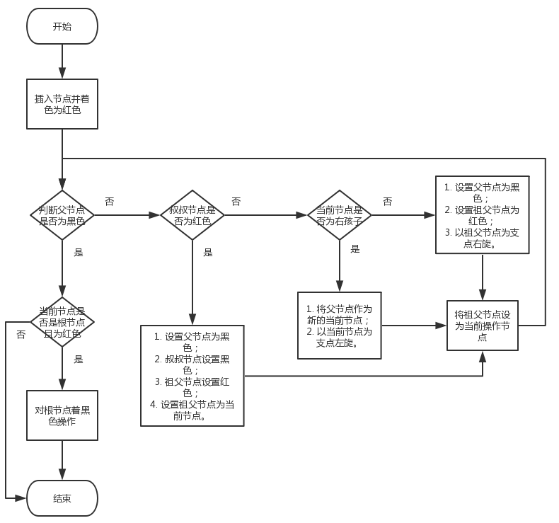

##### 3.2、删除

对于一个普通的二叉排序树来说，删除的节点的情况可以分为以下三种情况：

1. 叶子节点(二叉排序树的叶子节点指的是子节点都为null的节点)；
2. 只有左孩子或只有右孩子的节点；
3. 既有左孩子又有右孩子的节点。

###### 3.2.1、叶子节点

在红黑树中叶子节点指值为NIL的节点，此处的叶子节点沿用二叉排序树的叫法，指的是红黑树中左右子节点为NIL的节点，注意区分。

如果该节点的颜色为红色，那么该节点有两种情况，如下：

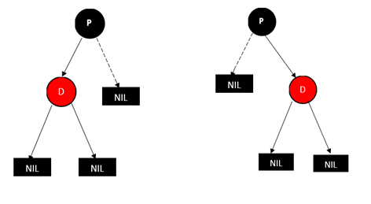

根据红黑树的特性5，其他情况都将不符合红黑树的结构。此时节点D可以直接删除，删除后线路上的黑色节点个数不变，保持特性5不变，即满足红黑树的所有特性。

如果该节点为黑色，那么该节点情况如下：

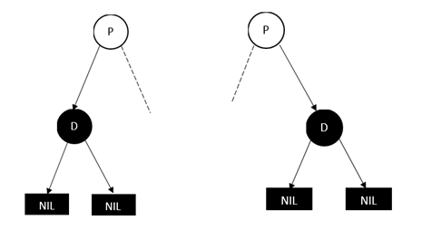

因为被删除节点为黑色节点，删除后必然会导致经过节点D线路上了黑色节点个数的减少，使得特性5不成立，此时红黑树需要调整。而且被删除的父节点及兄弟节点也存在多种情况，需要逐一分析。

1. **情况一  被删除节点的兄弟节点为红色节点**

   1. 被删除节点为父节点的左子节点

      此时的情况如图：

      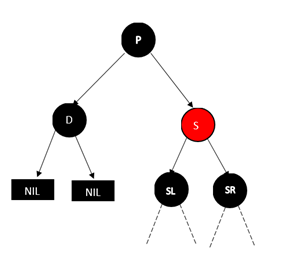

      此时将父节点P与兄弟节点S的颜色互换，并对兄弟节点P进行左旋操作，得到如下结果：

      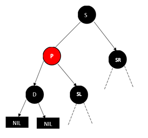

      此时，红黑树依旧满足所有特性，被删除节点D的情况变成了情况四

   2. 被删除节点为父节点的右子节点

      此时的情况如图：

      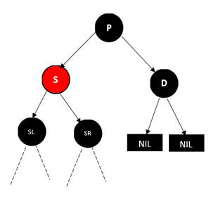

      此时将父节点P与兄弟节点S的颜色互换，并对兄弟节点P进行右旋操作，得到如下结果：

      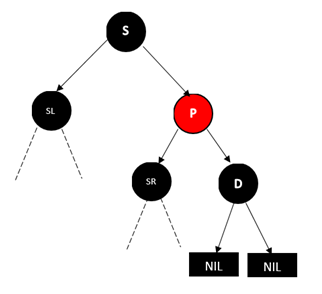

      此时，红黑树依旧满足所有特性，被删除节点D的情况变成了情况四

2. **情况二  被删除节点的兄弟节点为黑色，且远侄子节点为红色。**

   1. 被删除的节点为父节点的左子节点，红色的远侄子节点为兄弟节点S的右子节点

      此时情况如下图：

      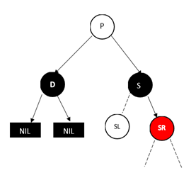

      此时直接删除节点D会使经过D的路径上黑色节点个数减一。先将节点P与节点S的颜色互换，然后对节点P进行左旋操作，并将SR节点置为黑色，最后删除节点D。得到如下图：

      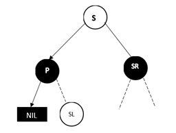

      整个调整在初始的P棵子树内进行的，所有与P节点的颜色无关。

   2. 被删除的节点为父节点的右子节点，红色的远侄子节点为兄弟节点S的左子节点

      此时情况如下图：

      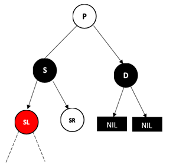

      此时将节点P和节点S的颜色对调，然后对节点P进行右旋操作，将节点SL的颜色置为黑色，再将节点D删除。结果如下图：

      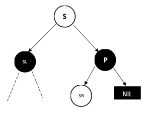

3. **情况三  被删除节点的兄弟节点S为黑色，远侄子节点为黑色，近侄子节点为红色**

   1. 被删节点D为父节点的左孩子，近侄子节点为节点S的左孩子。

      此时情况如下图：

      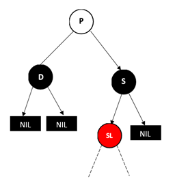

      此时将SL右旋，并将S和SL的颜色互换，这个时候就变成了情况二

      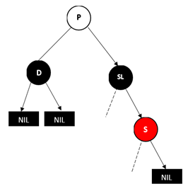

   2. 被删节点D为父节点的右孩子，近侄子节点为节点S的右孩子。

      此时情况如下图：

      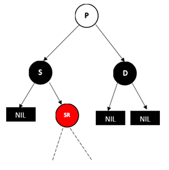

      此时将S和SR颜色对调，然后对SR进行左旋操作，这样就变成了情况二，结果如下图：

      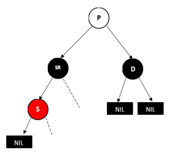

4. **情况四  被删除节点的父节点为红色，兄弟节点的两个子节点(只能是NULL节点)都为黑色**

   此时的情况如下：

   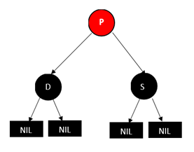

   将父亲节点P改成黑色，将兄弟节点S改成红色，然后删除D即可。如下图：

   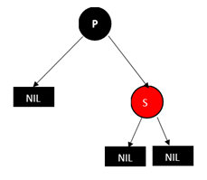

5. **情况五  被删除节点的父节点P、兄弟节点S和兄弟节点的两个子节点()都为黑色**

   此时的情况如下：

   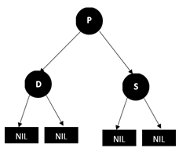

   将兄弟节点S的颜色改成红色，这样删除D后P的左右两支的黑节点数就相等了，但是经过P的路径上的黑色节点数会少1，这个时候，我们再以P为起始点，继续根据情况进行平衡操作（与插入节点后的调整操作一样，调整至满足红黑树的所有特性）。结果如下图：

   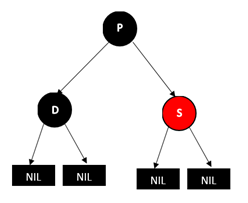

###### 3.2.2、只有左孩子或只有右孩子的节点

如果被删除节点只有左孩子或者右孩子，那么该节点为红色时，根据特性4、5可知该节点的另一个子节点也为NIL节点。所有该情况只有被删除节点为黑色时成立。情况如下图：

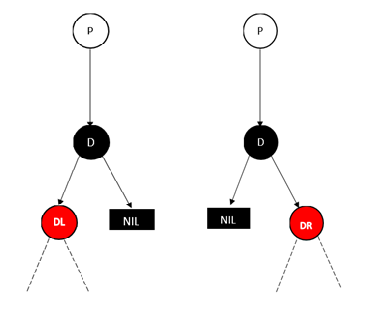

这两种情况的处理方式是一样的，即用D的孩子（左或右）替换D，并将D孩子的颜色改成黑色即可（因为路径上少了一个黑节点，所已将红节点变成黑节点以保持红黑树的性质）。

###### 3.3.3、既有左孩子又有右孩子的节点

一个既有左孩子又有右孩子的节点D要被删除时，首先需要找出它的替代节点S并与替代节点进行交换。替换节点S的查找规则：找出被删除节点D的右子树的最左节点。如下图：


假设被删除节点D为35，那么替代节点S则是40。这组数据的顺序如下：27、35、40、45、48、50、56、78、90，当35被删除后变成27、40、45、48、50、56、78、90。如下图：

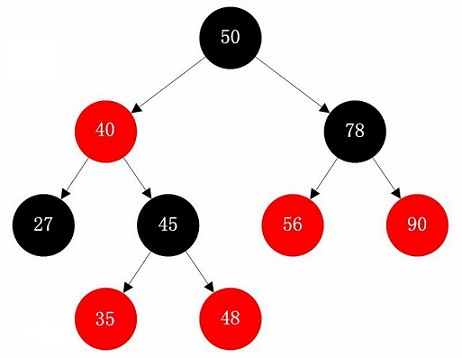


此时就可以将删除有左孩子又有右孩子的节点的情况转化为删除叶子节点的情况或者删除只有左孩子或只有右孩子的节点的情况。


在HashMap和TreeMap中红黑树删除即有左孩子又有右孩子的节点时的替换规则如上：找出被删除节点的右子树的最左节点。(Java1.8版本源码)

```java
//HashMap
TreeNode<K,V> p = this, pl = left, pr = right, replacement;
            if (pl != null && pr != null) {
                TreeNode<K,V> s = pr, sl;
                while ((sl = s.left) != null) // find successor
                    s = sl;
                ......
            }
//TreeMap
if (p.left != null && p.right != null) {
    Entry<K,V> s = successor(p);
    p.key = s.key;
    p.value = s.value;
    p = s;
}

static <K,V> TreeMap.Entry<K,V> successor(Entry<K,V> t) {
        if (t == null)
            return null;
        else if (t.right != null) {
            Entry<K,V> p = t.right;
            while (p.left != null)
                p = p.left;
            return p;
        } else {
            Entry<K,V> p = t.parent;
            Entry<K,V> ch = t;
            while (p != null && ch == p.right) {
                ch = p;
                p = p.parent;
            }
            return p;
        }
    }
```

由于红黑树也是一个二叉树，二叉树删除节点时的替换规则也有：被删除节点的左子树的最右节点。其效果一致，略微说明。


参考：https://www.cnblogs.com/qingergege/p/7351659.html（还有其他博客未能一一列出）

