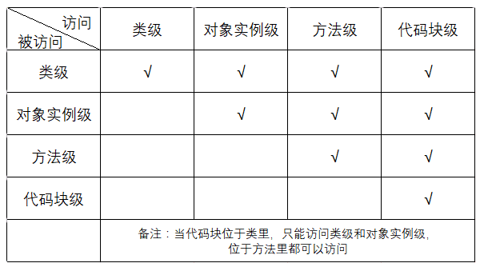

## 封装、继承、多态

#### 4.1 方法重写与重载

###### 4.1.1 重写(Overriding)

​		在Java中子类继承父类后具备了父类所有的特征，继承了父类所有的方法和变量。当子类需要修改父类的一些方法进行扩展，增强功能时，将这种操作称为重写，它使子类既可以隐藏和访问父类的方法，也可以覆盖继承父类方法。**重写是指子类中的方法与父类中继承的方法有完全相同的方法名、参数列表，返回值类型。**当子类需要使用调用父类的方法时可以使用**supper**关键字。重写需要遵循以下规则：
(1) 父类方法的参数列表必须完全与被子类重写的方法的参数列表相同。
(2) 父类的返回类型必须与被子类重写的方法返回类型相同。
(3) 被子类重写的方法不能拥有比父类方法更加严格的访问权限。
(4) 父类的访问权限修饰符的限制一定要大于被子类重写方法的访问权限修饰符。
(5) 父类当中的方法抛出异常，子类在重写父类的该方法时，也要抛出异常，而且抛出的异常不能多于父类中抛出的异常，但被重写方法可以声明更加宽泛的检查型异常。

###### 4.1.2 重载

​		重载是指在一个类中，多个方法的方法名相同，但是参数列表不同。参数列表不同指的是参数个数、参数类型或者参数的顺序不同。方法重载可以使类具有处理不同数据类型的能力，在调用方法时根据传递来的参数的个数及类型的不同来决定使用哪个方法，这就是多态。在进行方法重载时应该注意以下几点：
(1)在使用重载时只能通过不同的参数列表，必须具有不同的参数列表。
(2)不能通过访问权限、返回类型、抛出的异常进行重载。
(3)方法的异常类型和数目不会对重载造成影响。
(4)可以有不同的返回类型，只要参数列表不同就可以了。
(5)可以有不同的访问修饰符。
(6)可以抛出不同的异常。

#### 4.2 Java的继承与实现
###### 4.2.1 继承

​		如果有若干个类中有部分功能相同，将相同的部分抽取出来放入父类中，让若干类继承这个父类。继承是：**什么是一种什么，继承传达的意思是：is-a**，比如：猫 是一个 动物，猫就是动物的子类

###### 4.2.2 实现

​		如果有若干个类具有相同的处理目标，但处理方式不同，那么就可以定义一个接口，也就是一个标准，让若干类实现这个接口，然后各自实现自己具体的处理方法来处理目标。接口是：**对功能的描述（方法/行为），接口传达的意思是：拥有某种功能，能干嘛**，比如：Serializable代表可序列化的。     

###### 4.2.3 二者的联系

​		继承和接口都可以实现代码重用，提高开发效率。

###### 4.2.4 二者的区别

1. Java类只能继承一个父类，但可以实现多个接口，简称：单继承，多实现。
2. 在接口中只能定义全局变量和抽象方法，具体实现由继承的子类完成。父类是一个普通类，，子类可以继承父类属性方法，也可以重定义属性方法。

#### 4.3 构造函数与默认构造函数
​		构造函数是用于创建对象时对对象进行初始化的函数。函数名与类名相同，不需要定义返回值类型(void是没有具体返回值类型；构造函数是连类型都没有)。构造函数只有在创建对象时才会调用或在构造函数内调用，不能由一般函数调用。构造函数也可以进行重载，当不定义构造函数时，系统会给该类添加一个无参构造函数，方便该类初始化，但该类中自定义了构造函数，默认构造函数就没有了。如果仍要构造函数，则需要自己在类中手动添加。
#### 4.4 类变量、成员变量和局部变量
###### 4.4.1 位置不同

1. 成员变量是在类范围内定义的变量。
2. 由static修饰的成员变量称为类变量，实质是全局变量。
3. 局部变量是定义在方法中的变量。包括：形参、方法局部变量、代码块局部变量。

###### 4.4.2 初始化

1. 成员变量在对象初始化的时候进行初始化。
2.  类变量在类加载的时候进行初始化。
3.  局部变量除了形参外，都必须显式初始化。

###### 4.4.3 生命周期

1. 成员变量随着对象创建而存在，随着对象的回收而释放。
2. 类变量是随着类的加载而存在，随着类的消失而消失。
3. 局部变量是随着方法执行开始入栈时创建，执行完毕出栈时销毁

###### 4.4.4 数据存储位置不同

1. 成员变量存储在堆内存的对象中，所以也叫对象的特有数据。
2. 类变量存储在方法区（共享数据区）的静态区，所以也叫对象的共享数据。
3. 局部变量存储在栈内存中

#### 4.5 作用域
###### 4.5.1  对象作用域

1. public ：对象本身、同一个包下、子类、其他包下对象都可以调用
2. protected ：对象本身、同一个包下、子类对象可以调用
3. default ：对象本身、同一个包下对象可以调用
4. private ：对象本身可以调用，常用来修饰成员变量

|                   | 对象本身 | 同一包下 | 子类 | 其他包 |
| ----------------- | :------: | :------: | :--: | :----: |
| public            |    √     |    √     |  √   |   √    |
| protected         |    √     |    √     |  √   |        |
| friendly(default) |    √     |    √     |      |        |
| private           |    √     |          |      |        |

###### 4.5.2 变量作用域

1. 类级：类级变量又称全局级变量或静态变量，需要使用static关键字修饰。类级变量在类定义后就已经存在，占用内存空间，可以通过类名来访问，不需要实例化。
2. 对象实例级：对象实例级变量就是成员变量，实例化后才会分配内存空间，才能访问。
3. 方法级：方法级变量就是在方法内部定义的变量，就是局部变量。
4. 块级：块级变量就是定义在一个块内部的变量，变量的生存周期就是这个代码块。



测试代码如下：
```
public class Test1 {

    private Integer a2 ;
    public static Integer a1 = 1;

    {
        int a4 = 4;
        System.out.println("类级代码块a1：" + a1);
        System.out.println("类级代码块a2：" + a2);
        //System.out.println("类级代码块a3：" + a3);
        System.out.println("类级代码块a4：" + a4);

    }

    public Test1(Integer a2) {
        this.a2 = a2;
    }

    public void abc(){
        int a3 = 3;
        {
            int b4 = 44;
            System.out.println("方法级代码块a1：" + a1);
            System.out.println("方法级代码块a2：" + a2);
            System.out.println("方法级代码块a3：" + a3);
            System.out.println("方法级代码块b4：" + b4);
        }

        System.out.println("方法级a1：" + a1);
        System.out.println("方法级a2：" + a2);
        System.out.println("方法级a3：" + a3);
        //System.out.println(a4);
        //System.out.println(b4);
    }

    public static void main(String[] args) {

        Test1 t = new Test1(2);
        System.out.println("============");
        t.abc();
    }
}
```

>测试结果：
>
>类级代码块a1：1
>类级代码块a2：null
>类级代码块a4：4
>
>============
>
>方法级代码块a1：1
>方法级代码块a2：2
>方法级代码块a3：3
>方法级代码块b4：44
>
>方法级a1：1
>方法级a2：2
>方法级a3：3