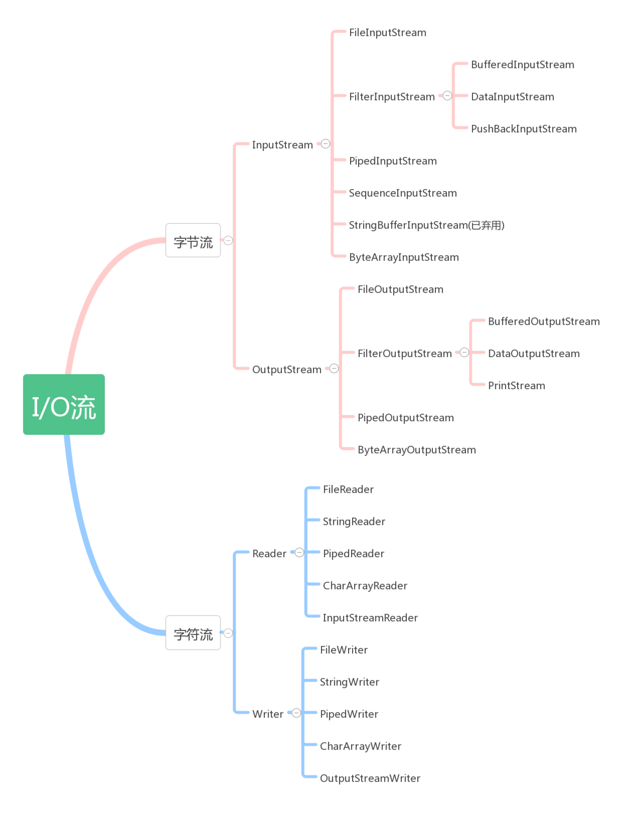

## Java IO

Java IO主要是指Java中输入、输出操作。Java的IO机制是基于数据流进行输入输出的，数据流是一组有序，有起点和终点的字节数据序列。

- Java IO的类型
  
  根据流的流向可以分为输入流和输出流，根据处理单位又可以分为字节流和字符流。

|   ~    |    字节流    | 字符流 |
| :----: | :----------: | :----: |
| 输入流 | InputStream  | Reader |
| 输出流 | OutputStream | Writer |

  InputStream、OutputStream及Reader、Writer类是java.io包下的基类，实际处理流的类都是由这四个类派生而来。
  