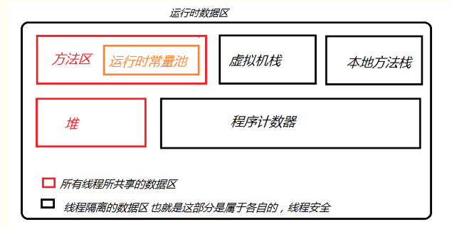

## Java内存模型

### 1 Java内存区域（运行时数据区）

运行时数据区的构成部分：

#### 1、线程共享数据区：

##### 1、堆

堆是Java虚拟机管理的内存中最大的一块，该区域的目的就是存放对象实例，几乎所有的对象实例以及数组都在这里分配内存。通常我们所说的new对象，该对象就会在堆中开辟一块内存存放对象中的一些信息，比如属性等。
堆也是垃圾收集器管理的主要区域，因此也被称作GC堆。现代垃圾 收集器基本都采用分代垃圾收集算法，所以Java堆还可以分为新生代、老年代。

##### 2、方法区

方法区是用于存储已经被虚拟机加载的类的信息、常量、静态变量、即时编译器编译后的代码等数据。常量也位于方法区中，这是因为方法区中有一个运行常量池。Class文件中除了类的版本、字段、方法、接口等描述信息外，还有常量池信息用于存放编译期生成的各种字面量和符号引用（该常量池区别于运行时常量池）。当类加载到方法区中时，就会将字节码文件的常量池中的内容放入运行时常量池，此外方法在运行过程中也会将新的常量放入常量池，如String.intern()方法。

#### 2、线程隔离数据区：

##### 1、虚拟机栈：

虚拟机栈描述的是Java方法执行的内存模型，是由一个个栈帧组成的，每个方法在执行的时候都会创建一个栈帧用来存放局部变量、操作数栈、动态链接、方法出口信息等。一个方法的执行过程就对应一个栈帧的入栈到出栈的过程。
虚拟机栈会出现两个错误：StackOverFlowError 和OutOfMemoryError。

- StackOverFlowError：若Java虚拟机栈的内存大小不允许动态扩展，那么当线程请求栈的深度超过当前Java虚拟机栈的最大深度的时候，就抛出StackOverFlowError异常。
- OutOfMemoryError：若 Java 虚拟机栈的内存大小允许动态扩展，且当线程请求栈时内存用完了，无法再动态扩展了，此时抛出OutOfMemoryError异常。

##### 2、程序计数器

程序计数器是当前线程所执行的字节码的行号指示器，通过计数器的值来判断需要执行的字节码指令，分支、循环、跳转、异常处理、线程恢复等功能都依赖计数器来完成。计数器的作用主要有两个：
1、字节码解释器通过改变程序计数器来依次读取指令，从而实现代码流程的控制；
2、多线程情况下，计数器用于记录当前线程执行的位置，从而当线程被切换回来的时候能够知道线程执行到哪儿了。

##### 3、本地方法栈

本地方法栈类似于虚拟机栈，虚拟机栈是执行Java方法而服务，当虚拟机调用本地方法时则会用到本地方法栈。

### 2 Java创建对象过程

#### 1 类加载检查

当虚拟机遇到一条new指令时，首先将检查这个指令的参数是否能够在常量池中定位到这个类到的无符号引用，并检查这个符号引用代表的类是否已被加载过、解析和初始化过。如果没有，那么必须先进行类加载。

#### 2 分配内存

当类加载检查通过后，接下来虚拟机将为新生对象分配内存，对象所需要的内存大小 在类加载完成后便可确定，为对象分配空间的任务等同于把一块确定大小的内存从Java堆中划分出来。

##### 2.1 内存分配方式

内存分配方式有以下两种方式，选择那种方式由Java堆是否规整决定，而堆是否规整又由所采用的垃圾收集器的算法是“标记-清除”，还是“标记-整理”，此外复制算法的内存也是规整的。

###### 2.1.1 指针碰撞

假设Java堆中的内存是绝对规整的，所有用过的内存都放在一边，空闲的内存在另一边，中间放着一个作为分界点的指示器，所有分配内存就仅仅是把那个指针向空闲空间那边挪动一段与对象大小相等的距离。

###### 2.1.2 空闲列表

有一个列表记录了堆中哪些内存块有用，在分配的时候从列表中找到一块足够大的空间划分给对象实例，然后更新列表中的记录。

##### 2.2 内存分配并发

创建对象是很频繁的一个操作，这就涉及线程安全问题，作为虚拟机来说，必须要保证线程是安全的，虚拟机采用两种方式来保证线程安全。

###### 2.2.1 CAS+失败重试

CAS是乐观锁的一种实现方式，乐观锁是假设没有冲突而去完成某项操作，如果没有因为冲突失败就重试，直到成功为止。虚拟机采用CAS配上失败重试的方式保证更新操作的原子性。

###### 2.2.2 TALB

为每一个线程预先在Eden区分配一块内存。JVM在给线程中的对象分配内存时，首先在TLAB分配，当对象大于TLAB中的剩余内存或TLAB的内存已用尽时，再采用上述CAS进行内存分配。

##### 3 初始化零值

内存分配完成后，虚拟机需要将分配的内存空间都初始化为零值(不包括对象头)，这一步操作保证了对象的实例字段在Java代码中可以不赋值就直接使用，程序能够访问到这些字段的数据类型所对应的零值。

##### 4 设置对象头

初始化零值完成之后，虚拟机要对对象进行必要的设置，例如这个对象是那个类的实例。如何才能找到类的元数据信息、对象的哈希码、对象的GC分代年龄等信息。这些信息存放在对象头中。另外根据虚拟机当前的运行状态的不同是否启用偏向锁等，对象头会有不同的设置方式。

##### 5 执行init方法

上述操作之后，在虚拟机角度一个新的对象已经产生了，但从Java程序的角度，对象创建才开始，init方法还没有执行，所有字段都为零。一般执行new指令之后会接着执行init方法，将对象按照程序员的意愿初始化，此时真正可用的对象才算完全生产出来。

#### 3、对象的内存布局

在虚拟机中，对象在内存中的布局分为3块区域：对象头、实例数据、对齐填充。

- 对象头包含两部分：第一部分用于存储对象自身的运行时数据(哈希码、GC分代年龄、锁状态标志等)，另一部分是类型指针，即对象指向它的类元数据的指针，虚拟机通过这个指针来确定这个对象是那个类的实例。
- 实例数据部分是对象真正存储的有效信息，也是在程序中所定义的各种类型的字段内容。
- 对齐填充部分不是必然存在的，也没有什么特别的含义，仅仅起占位作用。因为虚拟机的自动内存管理系统要求对象的起始地址必须是8字节的整数倍，也就是说对象的大小必须是8字节的整数倍。而对象头正好是8字节的整数倍，所以当对象实例数据部分没有对齐时，就需要通过对齐填充来补全。

#### 4、对象的访问定位

程序通过栈上的reference数据来操作堆上的具体对象，对象的访问方式有虚拟机实现而定，目前主要有两种：句柄、直接指针

##### 1、句柄访问

句柄访问会在堆中向划分一块内存作为句柄池，栈中的reference中存储的就是对象的句柄地址，而句柄中包含了对象实例数据与类型数据各自的具体地址信息。

##### 2、直接指针访问

直接地址访问时栈中的reference中存储的直接就是对象的地址，对象中包含了对象类型数据的地址。

##### 3、区别

使用句柄来访问的最大好处就是引用变量中存储的是稳定的句柄地址，对象被移动(在垃圾收集时移动对象是很普通的行为)时就会改变句柄中实力数据指针，但是引用变量所指向的地址不用改变。

而使用直接指针访问方式最大的好处就是速度更快，节省了一次指针定位的时间开销，但是在对象被移动时，又需要改变引用变量的地址。在我们上面分析的例子中，就是使用的直接指针访问的方式。