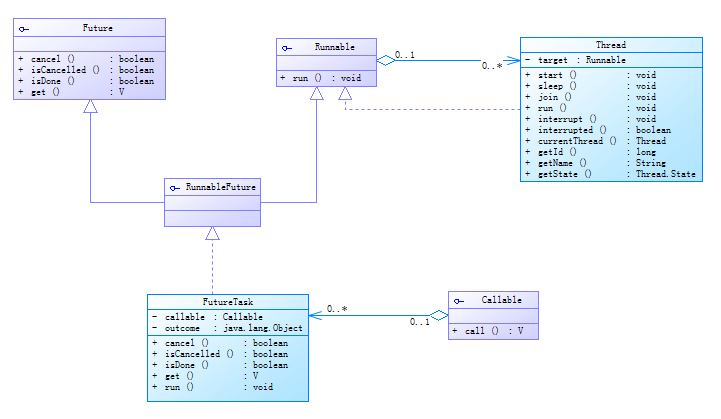

## Callable、Future和FutureTask

通过Callable和Future可以创建有返回结果的线程，此处涉及一个多线程并发开发中的常用模式--Future模式。

Future模式的核心思想是异步调用，它不会立即返回你需要的数据，但会返回一个契约，在将来可以凭借这个契约去获取你需要的信息。

例如：在传统同步方法中，调用一段耗时的程序，需要一定时间才会返回结果，而这时调用者只能阻塞等待，直到数据返回再进行其他任务处理。由于调用者需要数据返回，所以无法通过简单的单开线程解决长时间等待的问题。如果使用Future模式时，可以单开一个线程进行耗时的程序调用，在等待期间可以进行其他不依赖调用结果工作，然后在去查看是否调用完成返回了数据，再进行数据处理，此时就能节省大量时间。

#### 1、案例

场景：假如你突然想做饭，但是没有厨具，也没有食材。网上购买厨具比较方便，食材去超市买更放心。

此场景下，使用传统的同步方法去做，如下：

```java
public static void main(String[] args) throws InterruptedException{
    long begin = System.currentTimeMillis();
    //下单买餐具
    System.out.println("网上下单购买厨具！");
    System.out.println("等待快递员送件！");
    Tableware tableware = new Tableware();
    Thread.sleep(5000);
    System.out.println("厨具送达！");

    //去菜场买菜
    //买菜耗时
    Thread.sleep(100);
    Vegetables  vegetables = new Vegetables();
    System.out.println("菜场买菜！");
    
    //开始做饭
    cook(tableware, vegetables);
    System.out.println("耗时：" + (System.currentTimeMillis() - begin) + " 秒。");
}

private static void cook(Tableware tableware, Vegetables vegetables) {
    if (null != tableware && null != vegetables){
        System.out.println("开始做饭啦！");
    }else {
        System.out.println("不能做饭！！！");
    }

}

//定义的蔬菜类和厨具类
public class Vegetables {
}

public class Tableware {
}
```

程序运行结果如下：

```java
网上下单购买厨具！
等待快递员送件！
厨具送达！
超市买菜！
开始做饭啦！
耗时：6004 秒。
```

从结果上看整个流程以及结果都没有问题，就是耗时有点长，在网上下单购买餐具后的这段时间一直在家等待快递员送货上门，而这段时间实际是可以去买菜的，这样在餐具到达之后就可立即开始做饭了。

改进：单独创建一个线程去购买餐具，在启动这个线程后主线程就接着去买菜做饭。

创建一个线程，因为需要返回值，所以采用继承Thread类的方式：

```java
public class TablewareThread extends Thread {

    private Tableware tableware;

    public Tableware getTableware() {
        return tableware;
    }

    @Override
    public void run() {
        System.out.println("网上下单购买厨具！");
        System.out.println("等待快递员送件！");
        try {
            Thread.sleep(5000);
        } catch (InterruptedException e) {
            e.printStackTrace();
        }
        System.out.println("厨具送达！");
        this.tableware = new Tableware();
    }
}
```

原流程就改为如下：

```java
public static void main(String[] args) throws InterruptedException{

    TablewareThread thread = new TablewareThread();

    long begin = System.currentTimeMillis();
    //下单买餐具
    thread.start();

    //去菜场买菜
    //买菜耗时
    Thread.sleep(100);
    Vegetables  vegetables = new Vegetables();
    System.out.println("菜场买菜！");
    
    //开始做饭
    cook(thread.getTableware(), vegetables);
    System.out.println("耗时：" + (System.currentTimeMillis() - begin) + " 秒。");
}
```

运行结果：

```java
菜场买菜！
网上下单购买厨具！
等待快递员送件！
不能做饭！！！
耗时：1002 秒。
厨具送达！
```

根据结果可知此时程序出了问题，问题在于做饭的操作依赖餐具，所有必须等餐具送达才能开始做菜。此时的子线程必须调用join()方法，来保证做饭时餐具已经到达。

```java
public static void main(String[] args) {

    TablewareThread thread = new TablewareThread();

    long begin = System.currentTimeMillis();
    //下单买餐具
    thread.start();
    //等待子线程完成
    thread.join();
    ....
}
```

此时程序运行结果：

```java
网上下单购买厨具！
等待快递员送件！
厨具送达！
菜场买菜！
开始做饭啦！
耗时：6005 秒。
```

此时运行结果正确，但耗时与同步方法相差不同，没有达到我们想要节省时间开销的目的。此时是否还有解决方案呢？如果将代码改成如下：

```java
public static void main(String[] args) throws InterruptedException {

    TablewareThread thread = new TablewareThread();

    long begin = System.currentTimeMillis();
    //下单买餐具
    thread.start();

    //去菜场买菜
    //买菜耗时
    Thread.sleep(100);
    Vegetables  vegetables = new Vegetables();
    System.out.println("菜场买菜！");

    //等待子线程完成
    thread.join();

    //开始做饭
    cook(thread.getTableware(), vegetables);
    System.out.println("耗时：" + (System.currentTimeMillis() - begin) + " 秒。");
}
```

此时的运行结果如下：

```java
网上下单购买厨具！
等待快递员送件！
菜场买菜！
厨具送达！
开始做饭啦！
耗时：5008 秒。
```

此时的结果没有问题，而在等待餐具的时去完成了买菜操作，节省了买菜的时间，已经达到了我们的预期。

那么这个实现方法是否有什么弊端呢？

假如在菜场买菜时看到合适的厨具，此时像就地购买并向取消订单，上述流程并不能很好的处理此类问题。即不能对进行中的线程进行干预。

那通过Callable和Future来实现此案例是否能解决问题，代码如下：

```java
public static void main(String[] args) throws InterruptedException, ExecutionException {

    FutureTask<Tableware> futureTask = new FutureTask<>(() -> {
        System.out.println("网上下单购买厨具！");
        System.out.println("等待快递员送件！");
        try {
            Thread.sleep(5000);
        } catch (InterruptedException e) {
            e.printStackTrace();
        }
        System.out.println("厨具送达！");
        return new Tableware();
    });

    Thread thread = new Thread(futureTask);
    long begin = System.currentTimeMillis();
    //下单买餐具
    thread.start();

    //去菜场买菜
    //买菜耗时
    Thread.sleep(1000);
    Vegetables  vegetables = new Vegetables();
    System.out.println("菜场买菜！");

    //开始做饭
    cook(futureTask.get(), vegetables);
    System.out.println("耗时：" + (System.currentTimeMillis() - begin) + " 秒。");
}
```

结果如下：

```java
网上下单购买厨具！
等待快递员送件！
菜场买菜！
厨具送达！
开始做饭啦！
耗时：5003 秒。
```

由结果可知，此时已经完成之前的要求，接下来看是否能完成菜场买厨具并取消订单的功能。代码如下：

```java
public static void main(String[] args) throws InterruptedException, ExecutionException {

    FutureTask<Tableware> futureTask = new FutureTask<>(() -> {
        System.out.println("网上下单购买厨具！");
        System.out.println("等待快递员送件！");
        try {
            Thread.sleep(5000);
            System.out.println("厨具送达！");
            return new Tableware("网上");
        } catch (InterruptedException e) {
            //e.printStackTrace();
            System.out.println("网上下单取消！");
            return null;
        }
    });

    Thread thread = new Thread(futureTask);
    long begin = System.currentTimeMillis();
    Tableware tableware;
    //下单买餐具
    thread.start();

    //去菜场买菜
    //买菜耗时
    Thread.sleep(1000);
    Vegetables  vegetables = new Vegetables();
    System.out.println("菜场买菜！");
    //是否菜场买厨具
    if(new Random().nextBoolean() &&  futureTask.cancel(true)){
        tableware = new Tableware("菜场");
    }else{
        tableware = futureTask.get();
    }

    System.out.println("place = [" + tableware.getPlace() + "]");
    //开始做饭
    cook(tableware, vegetables);
    System.out.println("耗时：" + (System.currentTimeMillis() - begin) + " 秒。");
}
```

其多次运行结果如下：

```java
网上下单购买厨具！
等待快递员送件！
菜场买菜！
厨具送达！
place = [网上]
开始做饭啦！
耗时：5001 秒。
-------------------------------------
网上下单购买厨具！
等待快递员送件！
菜场买菜！
place = [菜场]
开始做饭啦！
耗时：1005 秒。
网上下单取消！
```

此时使用Callable和Future创建线程可以在线程运行期间对线程进行操作。

#### 2、JDK中的实现

在以上例子中用到了Callable接口以及TutureTask类，它们之间的关系如下图：



###### 2.1、Future接口

Future接口位于java.util.concurrent包下面，定义了对Runnable或者Callable任务的一系列操作，取消任务、查询任务是否完成、获取任务结果。

- boolean cancel(boolean mayInterruptIfRunning)
  
  该方法用于取消任务，如果取消任务成功则返回true，如果取消任务失败则返回false。参数mayInterruptIfRunning表示是否允许取消正在执行却没有执行完毕的任务，如果设置true，则表示可以取消正在执行过程中的任务。如果任务已经完成，则无论mayInterruptIfRunning为true还是false，此方法肯定返回false，即如果取消已经完成的任务会返回false；如果任务正在执行，若mayInterruptIfRunning设置为true，则返回true，若mayInterruptIfRunning设置为false，则返回false；如果任务还没有执行，则无论mayInterruptIfRunning为true还是false，肯定返回true。

- boolean isCancelled();
  
  该方法表示任务是否被取消成功，如果在任务正常完成前被取消成功，则返回 true。

- isDone();
  
  该方法表示任务是否已经完成，若任务完成，则返回true；

- V get(long timeout, TimeUnit unit)
  
  方法用来获取执行结果，这个方法会产生阻塞，会一直等到任务执行完毕才返回；

- V get(long timeout, TimeUnit unit)
  
  该方法用来获取执行结果，如果在指定时间内，还没获取到结果，就直接返回null。

由Future接口定义的这些方法可知，Future提供了获取任务结果、中断任务、判断任务是否完成的功能。

###### 2.2、Runnable接口与Callable接口

Runnable接口只有一个run()方法，Callable接口只有一个call()方法，这两两个方法都是用于定义任务内容的具体实现的，区别在于run()方法是没有返回值而call()方法可以返回任务结果。

###### 2.3、FutureTask类

由上面类图可知FutureTask实现了FutureRunnable接口，而FutureRunnable接口继承了Future接口和Runnable接口，即也实现这两个接口定义的功能。

FuturnTask类有两个构造方法：

```java
public FutureTask(Callable<V> callable)
public FutureTask(Runnable runnable, V result)
```

当使用Runable接口实现类和返回值类型创建对象时是将Runable的实现类和返回值类型通过适配器转换成了Callable类型。

在该类的run()方法中，运行的是Callable类型的call方法，然后保存运行结果给成员变量outcome，运行状态给成员变量state。

```java
public void run() {
    if (state != NEW ||
        !UNSAFE.compareAndSwapObject(this, runnerOffset,
                                     null, Thread.currentThread()))
        return;
    try {
        Callable<V> c = callable;
        if (c != null && state == NEW) {
            V result;
            boolean ran;
            try {
                result = c.call();
                ran = true;
            } catch (Throwable ex) {
                result = null;
                ran = false;
                setException(ex);
            }
            if (ran)
                set(result);
        }
    } finally {
        // runner must be non-null until state is settled to
        // prevent concurrent calls to run()
        runner = null;
        // state must be re-read after nulling runner to prevent
        // leaked interrupts
        int s = state;
        if (s >= INTERRUPTING)
            handlePossibleCancellationInterrupt(s);
    }
}
```

获取运行结果及状态也就是获取这两个成员变量的值。由于他实现了Runnable接口，所以它能够传递给Thread类创建对象。

#### 3、Future不足

由上面的例子可以看出使用Future模式可以一定程度上让多线程间进行异步操作，但是回调无法放到与任务不同的其他线程中执行，传统回调最大的问题就是不能将控制流分离到不同的事件处理器中。比如主线程要等各个异步执行线程返回的结果来做下一步操作，就必须阻塞在future.get()方法等待结果返回，这时其实又是同步了。