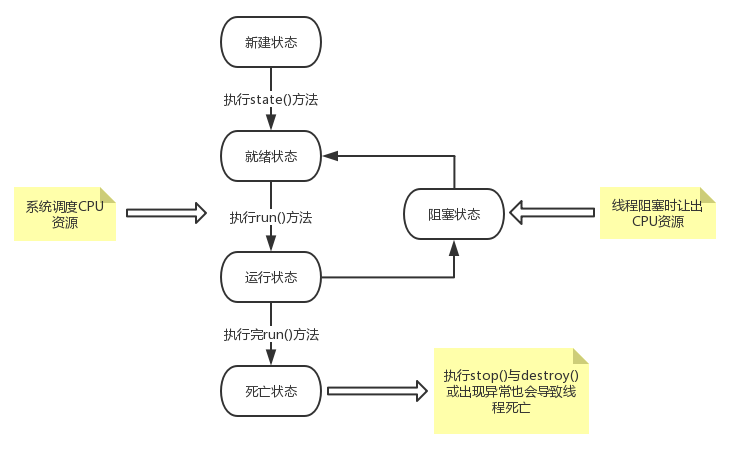

## 多线程

#### 1、线程

- 进程：一个进程包括由操作系统分配的内存空间，包含一个或多个线程。一个线程不能独立的存在，它必须是进程的一部分。一个进程一直运行，直到所有的非守护线程都结束运行后才能结束。
- 线程：线程是指进程中一个单一顺序的控制流，一个进程中可以并发多个线程，每条线程并行执行不同的任务，多线程可以达到充分利用CPU的目的。

#### 2、线程的生命周期

线程是一个动态的执行过程，其生命周期如下图：



- 新建状态：

  Thread类或者其子类new一个线程对象后，该线程对象就处于新建状态，保持该状态直到程序start()方法。

- 就绪状态：

  当线程对象调用了start()方法之后，该线程就进入就绪状态。就绪状态的线程处于就绪队列中，等待JVM里线程调度器的调度。

- 运行状态：

  如果就绪状态的线程获取了CPU资源，就可以run()方法，此时线程处于运行状态。运行状态的线程复杂多变，在此阶段可以变成阻塞、就绪和死亡状态。

- 阻塞状态：

  如果一个线程执行了sleep()、suspend()等方法，失去CPU等资源占用后，该线程就会由运行状态进入阻塞状态。在睡眠时间结束或者获得资源后就可以进入就绪状态。可分为以下三种：

  - 等待阻塞：运行状态中的线程执行wait()方法，使线程进入到等待阻塞状态。
  - 同步阻塞：线程在获得synchronized同步锁失败。
  - 其他阻塞：通过调用线程的sleep()或者join()方法发出I/O请求式，线程就会进入阻塞状态。当sleep()状态超时，join()等待线程终止或者超时，或者I/O处理完毕，线程重新进入就绪状态。

- 死亡状态：

  一个运行状态的线程完成任务或者其他终止条件发生时，该线程就切换到死亡状态。

#### 3、线程优先级

每个线程都具有一个优先级，这样有助于操作系统确定线程的调度顺序。Java线程的优先级是一个整数，取值范围是1() - 10()。默认情况下，会给每个线程设置一个默认优先级5()。

具有较高优先级的线程对程序更重要，并且应该在低优先级的线程之前分配处理器资源。但是线程优先级不能保证线程的执行顺序，而且非常依赖平台。

#### 4、线程的实现方式

Java提供三种创建线程的方式：

- 通过实现Runnable接口；
- 通过继承Thread类；
- 通过Callable和Future创建。

###### 4.1、实现Runnable接口

通过线程的状态可知，线程通过run()方法进入运行状态。而Runnable接口就定义了线程的run()方法，通过实现Runnable接口重写run()方法来实现线程的功能。

实现Runnable接口的方式创建线程也需要Thread类，Thread类的构造函数Thread(Runnable target)、Thread(Runnable target, String name)传入一个Runnable类型的参数，即可以给线程命名也可以系统默认。通过向Thread类传入Runnable实现类，再通过Thread类的start()方法启动线程。代码如下：

- 创建Runnable接口实现类

  ```java
  public class MyRunnable  implements Runnable{
      @Override
      public void run() {
          System.out.println("Runnable创建线程");
      }
  }
  ```

- 创建Thread类，并启动线程

  ```java
  public static void main(String[] args) {
      Thread runable = new Thread(new MyRunnable(),"myRunnable");
      runable.start();
      System.out.println("runable = [" + runable.getName() + "]");
  
      Thread runable2 = new Thread(new MyRunnable());
      runable2.start();
      System.out.println("runable2 = [" + runable2.getName() + "]");
  }
  ```

- 运行结果

  ```java
  runable = [myRunnable]
  runable2 = [Thread-0]
  Runnable创建线程
  Runnable创建线程
  ```

###### 4.2、继承Thread类

继承Thread类并重写Thread类的run()方法，该方法调用的是Runnable类型成员变量target的run()方法，代码如下。此时没有传入Runnable类型的变量，所以必须重写该方法。

```java
private Runnable target;
....
@Override
public void run() {
    if (target != null) {
        target.run();
    }
}
```

- 继承Thread类并重写run()方法

  ```java
  public class MyThread extends Thread {
  
      @Override
      public void run() {
          System.out.println("Thread创建线程");
      }
  }
  ```

- 创建该子类的实例，并执行start()方法

  ```java
  public static void main(String[] args) {
      Thread myThread = new MyThread();
      myThread.start();
  }
  ```

- 运行结果

  ```java
  Thread创建线程
  ```

此方式如果要自定义线程名称需要创建构造方法并调用父类方法。

```java
public MyThread(String name) {
    super(name);
}
```

###### 4.3、通过Callable和Future创建

通过实现Runnable接口或者继承Thread类创建线程时，有一个缺陷：在执行完任务之后无法获取执行结果。如果需要获取执行结果，就必须通过共享变量或者使用线程通信的方式来达到效果，这样使用起来就比较麻烦。在Java 1.5开始，就提供了Callable和Future，通过它们可以在任务执行完毕之后得到任务执行结果。此处只演示一个简单demo，后面再详细总结。

- 实现Callable接口

  创建 Callable 接口的实现类，并重写 call() 方法，该 call() 方法将作为线程执行体，并且有返回值。

  ```java
  public class MyCallable implements Callable<Integer> {
      @Override
      public Integer call() throws Exception {
          System.out.println("Callable创建线程");
          return 1;
      }
  }
  ```

- 使用 FutureTask 类来包装 Callable 对象

  FutureTask是Callable接口实现类的包装类，该类实现了RunnableFuture接口，而RunnableFuture接口继承了Runnable接口，所以FutureTask也重写了Runnable接口的run()方法。在run方法中执行了Callable 接口实现类的 call() 方法，并保存了执行结果。源代码如下：

  ```java
  //FutureTask类的run()方法
  public void run() {
      if (state != NEW || !UNSAFE.compareAndSwapObject(this, runnerOffset, null, Thread.currentThread()))
          return;
      try {
          Callable<V> c = callable;
          if (c != null && state == NEW) {
              V result;
              boolean ran;
              try {
                  result = c.call();
                  ran = true;
              } catch (Throwable ex) {
                  result = null;
                  ran = false;
                  setException(ex);
              }
              if (ran)
                  set(result);
          }
      } finally {
          runner = null;
          int s = state;
          if (s >= INTERRUPTING)
              handlePossibleCancellationInterrupt(s);
      }
  }
  ```

  创建FutureTask类对象，并传入Callable 接口的实现类

  ```java
  FutureTask<Integer> futureTask = new FutureTask<>(new MyCallable());
  ```

- 创建Thread 对象的 target 创建并启动新线程

  ```java
  Thread thread = new Thread(futureTask);
  thread.start();
  ```

- 调用 FutureTask 对象的 get() 方法来获得子线程执行结束后的返回值

  ```java
  //整个main方法
  public static void main(String[] args) {
      FutureTask<Integer> futureTask = new FutureTask<>(new MyCallable());
      Thread thread = new Thread(futureTask);
      thread.start();
      try {
          System.out.println("FutureTask = [" + futureTask.get() + "]");
      } catch (InterruptedException e) {
          e.printStackTrace();
      } catch (ExecutionException e) {
          e.printStackTrace();
      }
  
  }
  ```

- 运行结果

  ``` java
  Callable创建线程
  FutureTask = [1]```
  ```

#### 5、线程的实现方式优缺点

- 采用实现 Runnable、Callable 接口的方式创建多线程时，线程类只是实现了 Runnable 接口或 Callable 接口，还可以继承其他类，当程序发生更改时只改变接口实现类即可，使用上方便灵活。

- 使用继承 Thread 类的方式创建多线程时，编写简单，如果需要访问当前线程，则无需使用 Thread.currentThread() 方法，直接使用 this 即可获得当前线程。
- 通过Callable和Future创建线程可以很好解决线程结果返回问题。